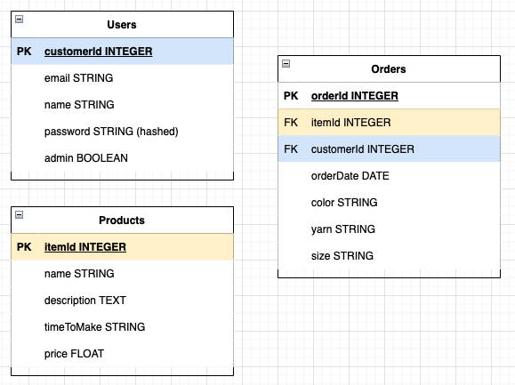

# Commerce Template - Stu Knits
Project idea: A template for a small e-commerce website that users could get a subscription to in order to sell their goods. For the initial deployment of this app, I will be creating a commerce page for my fiancee to be able to sell her knitting projects - Stu Knits. She will be able to upload designs and patterns that she would be able to make along with the expected turnaround time, color options, yarn material, and price. She will also be able to communicate with the buyer via email and update them when their order has been received, and shipped. Buyers will be able to see all the available options and make a purchase through Shopify API and get updates.

# Technologies
Full-stack MERN app with Shopify buy button for purchases. New technologies that I am considering implementing is GraphQL for buy button API call and Sass for styling.

# Wireframes

# ERD
